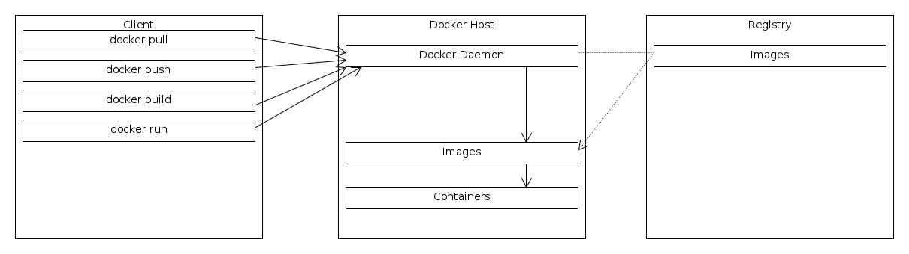

# Docker

## Overview


## Install with snap
```
sudo snap install docker
``` 
* check status 
```
$ sudo snap services 
Service Startup  Current   Notes
docker.dockerd enabled  inactive  -
```
* start / stop
```
sudo snap start docker
Started.

sudo snap stop docker
Stopped.
```

## Docker Compose
* get docker compose
```
curl -L "https://github.com/docker/compose/releases/download/1.27.4/docker-compose-$(uname -s)-$(uname -m)" -o ~/development/docker-compose
```
* make it executable
```
chmod -x ~/development/docker-compose
```
* check 
```
./docker-compose -version
docker-compose version 1.27.4, build 40524192
```

## Cheatsheet

__shell__
* connect to container with bash: `docker exec -it CONTAINERID bash`

__list__
* images: `docker images` 
* container: `docker ps`

__remove__
* image with force: `docker image rm -f IMAGE-ID`
    * or: `docker rmi IMAGE-ID`
* container with force: `docker rm -f CONTAINER-ID`
* delete all stopped container: `docker rm $(docker ps -a -q)`

__stop container__
* stop: `docker stop CONTAINER-ID`

__bash__
* connect to container: `docker exec -it CONTAINER-ID /bin/bash`

__prune__
* clean up (prune) images, containers, and networks: `docker system prune`

## further docker commands
* list images: `docker images`
* list container: `docker container ls` or `docker ps` 
* remove container: `docker rm CONTAINERID` or force `docker rm -f CONTAINERID`
* remove image: `docker rmi IMAGEID`
* connect to container with bash: `docker exec -it CONTAINERID bash`
* run container and dont kill it for 10s: `docker run -d python sleep 10`

## troubleshooting
* use `--net=host` argument for host ip in container. otherwise the container will have its own ip
