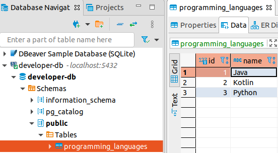

# PostgreSQL with Dockerfile

## Files
```
Dockerfile
init.sql
```

## Build and Run
* build: Build an image from a Dockerfile
```
sudo docker build -t dockerfile-postgres-image .
sudo docker run -d --name dockerfile-postgres-image -p 5432:5432 dockerfile-postgres-image
```

## Remove container
```
docker rm -f <container-id>
```

## Connect to PostgreSQL with DBeaver

